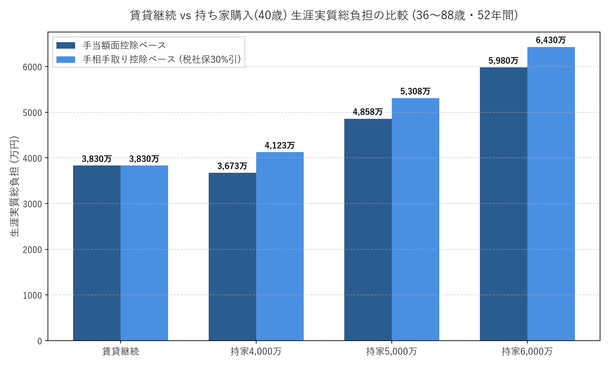
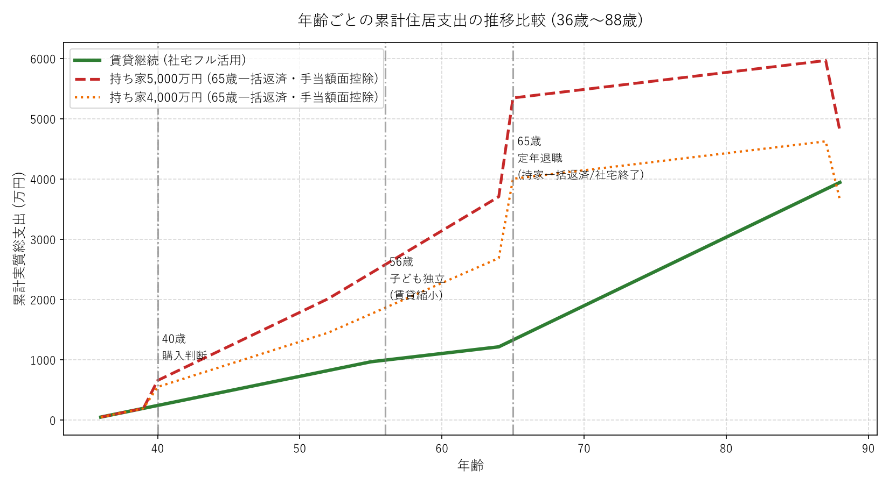
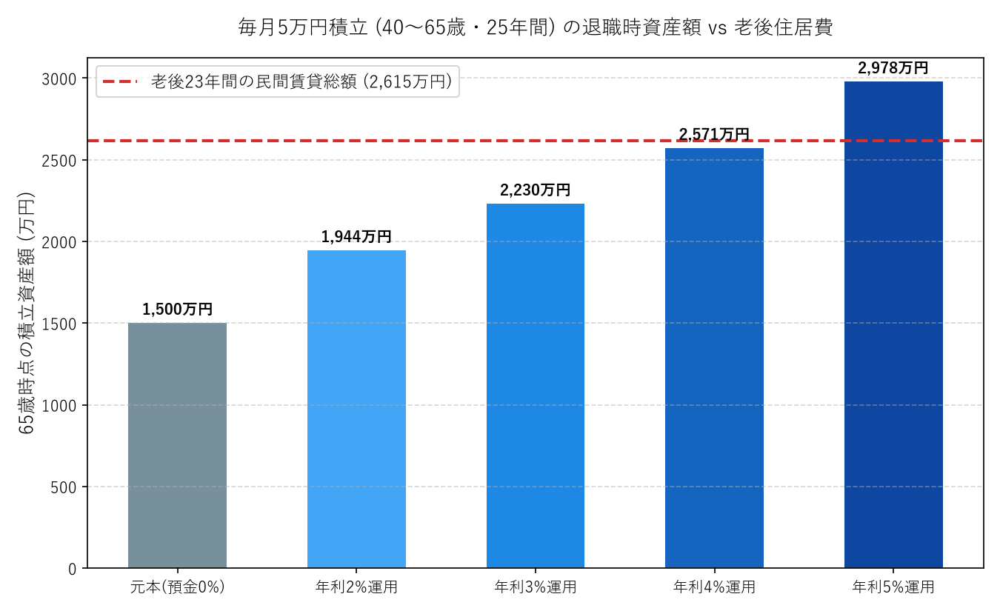

# 賃貸・持家 比較検討および経済合理性シミュレーション（改訂版）

本ドキュメントは、**「40歳時点で持ち家を購入するか判断する」** というタイムライン設定のもと、賃貸継続（借り上げ社宅活用）と持ち家購入（4,000万／5,000万／6,000万円、住宅ローン減税考慮、65歳退職金一括返済）の生涯費用、現役期のキャッシュフロー、および **「差額のうち毎月5万円を積み立てた場合（月2万円は生活費・教育費等に充当）」** の退職後資産形成を定量的に再計算した記録です。

---

## 1. エグゼクティブサマリー（結論）

```
【生涯実質総負担（36歳〜88歳の52年間）の比較】
・賃貸継続シナリオ（社宅活用＋民間賃貸） : 約 3,830 万円
・持ち家 4,000 万円（金利1.0%/退職時一括返済）: 約 3,673 万円（手当額面） / 約 4,123 万円（手相手取）
・持ち家 5,000 万円（金利1.0%/退職時一括返済）: 約 4,858 万円（手当額面） / 約 5,308 万円（手相手取）
・持ち家 6,000 万円（金利1.0%/退職時一括返済）: 約 5,980 万円（手当額面） / 約 6,430 万円（手相手取）
-----------------------------------------------------------------------------------------
⇒ 5,000万円物件対比で、賃貸が 約 1,029 万〜1,479 万円 有利（土地残存1,200万控除後）
⇒ 4,000万円物件であっても、手当の課税（手取りベース）を考慮すると 賃貸が 約 294 万円 有利
```

1. **経済合理性の分岐点**:
   - 首都圏で家族4人が暮らす一戸建ての現実的な価格帯（5,000万〜6,000万円）では、**賃貸継続が1,000万〜2,600万円単位で圧倒的に有利** です。
   - 4,000万円の安価な物件を購入した場合、手当を額面満額で算出すれば持ち家が約156万円下回りますが、手当の給与課税（手取り約7割）を考慮すると **4,000万円物件でも賃貸の方が約294万円有利** となります。

2. **退職時の一括返済リスク（退職金の激減）**:
   - 持ち家の場合、65歳時点で **約1,289万〜1,933万円のローン残債** が残り、退職金から一括返済する必要があります。これにより、老後の医療・介護・余暇資金としての退職金が大幅に削り取られます。

3. **「月5万円積立（月2万円ゆとり消費）」での老後住居費カバー力**:
   - 賃貸で浮く差額（月約7.1万〜10.2万円）のうち、**月2万円（25年で600万円）を日々の生活・教育・家族旅行等に使いながら、月5万円だけを積立運用** した場合：
     - **年利3%運用で 約2,230万円**（老後23年間の民間家賃2,615万円の **85.3%** をカバー）
     - **年利4%運用で 約2,571万円**（老後家賃の **98.3%** をカバー）
   - さらに、持ち家でも老後に維持管理・固定資産税で約634万〜822万円かかるため、**純粋な差額（約1,800万〜2,000万円）で比較すれば、年利2%運用（約1,944万円）の時点で老後住居費の増加分は100%完全に相殺** されます。

---

## 2. 視覚的サマリー（グラフ）

### 2.1 生涯実質総負担の比較


### 2.2 年齢ごとの累計住居支出推移（36歳〜88歳）

> ※40歳での購入初期費用、56歳の子ども独立に伴う賃貸縮小、65歳時点の持ち家一括繰上返済（退職金からの支出ジャンプ）、88歳時点の土地残存価値控除を可視化。

### 2.3 毎月5万円積立時の退職時資産額 vs 老後住居費


---

## 3. 前提条件の再整理（事実・推定・仮説）

### 3.1 事実（確定条件・修正反映）
- **共通期間（36〜40歳の4年間）**: 全員賃貸（社宅利用）。
- **購入判断時期**: **40歳**（36歳時点では購入せず、5年間の大手町勤務を経て判断）。
- **賃貸の費用負担ルール**:
  - 更新料：**0 円（会社負担）**
  - 勤務中の住み替え引越費用：**0 円（会社負担）**（異動辞令のタイミングで住み替え）
  - 老後（65歳以降）：**民間賃貸を想定**（URではない。家賃9万円、更新料2年1ヶ月・火災保険等は自己負担）。
- **持ち家の費用負担ルール**:
  - 物件価格：**4,000万円 / 5,000万円 / 6,000万円**
  - 住宅ローン：35年元利均等返済・金利1.0%
  - **住宅ローン減税**：13年間適用（省エネ基準適合・上限4,000万円、年末残高の0.7%控除）
  - **65歳退職時の一括返済**：残債（残り10年分）を退職金で一括繰上返済
  - 会社手当：40歳〜65歳の25年間受給（首都圏月5万円、額面1,500万／手取り1,050万円）
- **積立条件**:
  - 差額のうち **毎月5万円積立**（月2万円は生活費・教育費・余暇に充当）。積立期間は40歳〜65歳の25年間。

### 3.2 推定・仮説（シミュレーションパラメータ）
- **子育て期間**: 36〜56歳（次男22歳就職まで）。40歳〜56歳の16年間は4人暮らし（広めの戸建て賃貸：家賃17.5万円、自己負担3.9万円/月）。
- **夫婦2人期・現役**: 56〜65歳の9年間。コンパクト賃貸（家賃11万円、自己負担2.2万円/月）。
- **老後期間**: 65〜88歳の23年間。民間賃貸（家賃9.0万円、実質月負担94,750円）。
- **持ち家維持費（40〜88歳の48年間）**:
  - 固定資産税・都市計画税：年10万〜14万円
  - 修繕・設備更新費：48年間で700万〜900万円
  - 保険：年3万円
- **土地残存価値（88歳時点）**: 4,000万物件＝1,000万円、5,000万物件＝1,200万円、6,000万物件＝1,500万円。

---

## 4. 生涯費用の詳細比較（数値検証）

### 4.1 総額比較サマリー表（36歳〜88歳・52年間）

| 比較項目 | 賃貸継続シナリオ | 持ち家 4,000万円 | 持ち家 5,000万円 | 持ち家 6,000万円 |
| :--- | :--- | :--- | :--- | :--- |
| **36〜40歳 賃貸支出（共通）** | 193 万円 | 193 万円 | 193 万円 | 193 万円 |
| **購入時諸費用（手出し）** | 0 円 | 280 万円 | 350 万円 | 420 万円 |
| **40〜65歳 ローン通常返済（25年）**| - | 3,387 万円 | 4,234 万円 | 5,081 万円 |
| **65歳 退職時一括繰上返済（残債）**| 0 円 | **1,289 万円** | **1,611 万円** | **1,933 万円** |
| └ ローン実質返済総額（元利計） | - | 4,676 万円 | 5,845 万円 | 7,015 万円 |
| **住宅ローン減税（13年間還付）** | 0 円 | **▲300 万円** | **▲350 万円** | **▲364 万円** |
| **会社住宅手当（25年受給・額面）**| - | ▲1,500 万円 | ▲1,500 万円 | ▲1,500 万円 |
| **維持修繕・固定資産税・保険（48年）**| 賃料に含まれる | 1,324 万円 | 1,520 万円 | 1,716 万円 |
| └ うち現役期（40〜65歳） | 0 円 | 690 万円 | 792 万円 | 894 万円 |
| └ うち老後期（65〜88歳） | 0 円 | 634 万円 | 728 万円 | 822 万円 |
| **現役期 社宅賃料（40〜65歳）** | **1,021 万円** | - | - | - |
| **老後23年 民間賃貸住居費** | **2,615 万円** | 0 円 | 0 円 | 0 円 |
| **88歳時点 土地残存価値** | 0 円 | ▲1,000 万円 | ▲1,200 万円 | ▲1,500 万円 |
| **生涯実質総負担（手当額面控除）** | **3,830 万円** | **3,673 万円** | **4,858 万円** | **5,980 万円** |
| **賃貸との差額（額面ベース）** | **基準** | **持家が -156 万円** | **賃貸が +1,029 万円有利** | **賃貸が +2,150 万円有利** |
| **生涯実質総負担（手相手取控除）** | **3,830 万円** | **4,123 万円** | **5,308 万円** | **6,430 万円** |
| **賃貸との差額（手取りベース）** | **基準** | **賃貸が +294 万円有利** | **賃貸が +1,479 万円有利** | **賃貸が +2,600 万円有利** |

---

## 5. 現役期のキャッシュフローと退職時一括返済のインパクト

### 5.1 現役期（40歳〜65歳・25年間）の月額実質負担比較
- **賃貸継続**:
  - 40〜56歳（子育て戸建て）：**約 40,250 円/月**（家賃自己負担3.9万＋保険0.1万、更新料0円）
  - 56〜65歳（コンパクト賃貸）：**約 23,000 円/月**（家賃自己負担2.2万＋保険0.1万、引越0円）
  - 25年間の月平均負担：**約 34,040 円/月**
- **持ち家 5,000万円（標準モデル）**:
  - ローン返済額：141,143 円/月
  - 住宅手当（会社支給）：▲50,000 円/月（手取り換算なら▲35,000円）
  - 固定資産税＋修繕積立＋保険：約 26,389 円/月
  - 住宅ローン減税（13年間）：約 ▲22,461 円/月
  - 現役期の実質月額負担（減税・手当額面控除後平均）：**約 105,852 円/月**（手取り基準なら **約 120,852 円/月**）
- **現役期の月額負担差（賃貸の浮き分）**:
  - 4,000万物件対比：**月 約 41,848 円**（手取り基準: 約56,848円）
  - 5,000万物件対比：**月 約 71,812 円**（手取り基準: 約86,812円）
  - 6,000万物件対比：**月 約 102,990 円**（手取り基準: 約117,990円）

### 5.2 65歳退職時の一括繰上返済と退職金の関係
40歳で35年ローンを組んだ場合、65歳退職時点ではまだ返済が10年分（120回）残っています。
退職金から一括返済する場合の所要額：
- **4,000万円借入**: **約 1,289 万円**
- **5,000万円借入**: **約 1,611 万円**
- **6,000万円借入**: **約 1,933 万円**

> [!WARNING]
> 大企業や公務員の標準的な退職金（約1,800万〜2,200万円）を想定した場合、5,000万〜6,000万円物件では **退職金の大部分（70%〜90%以上）が一括返済で消失** します。
> 賃貸であれば退職金が手元にほぼ100%温存されるため、手元流動性の観点からも賃貸の安全性が際立ちます。

---

## 6. 「月5万円積立（月2万円生活費充当）」の詳細検証

ユーザーの現実的な家計配分方針として、賃貸で浮く差額（月約7.2万〜10.3万円）のうち、
- **毎月 20,000 円**：子どもの教育費、習い事、家族旅行、日々の生活のゆとりに活用
- **毎月 50,000 円**：老後住居資金として新NISA等で積立運用

とした場合のシミュレーションです。

### 6.1 40歳〜65歳の25年間（計300ヶ月）積立時の資産推移

| 運用方針 | 毎月積立額 | 25年間の積立元本 | 65歳時点の資産総額 | 運用益 | 老後家賃（2,615万円）カバー率 |
| :--- | :--- | :--- | :--- | :--- | :--- |
| **元本（普通預金 0%）** | 50,000 円 | 1,500 万円 | **1,500 万円** | 0 円 | 57.4% |
| **保守的運用（年利 2%）**| 50,000 円 | 1,500 万円 | **1,944 万円** | +444 万円 | 74.3% |
| **堅実インデックス（年利 3%）**| 50,000 円 | 1,500 万円 | **2,230 万円** | +730 万円 | **85.3%** |
| **標準的株式運用（年利 4%）**| 50,000 円 | 1,500 万円 | **2,571 万円** | +1,071 万円 | **98.3%（ほぼ全額）** |
| **成長型株式運用（年利 5%）**| 50,000 円 | 1,500 万円 | **2,978 万円** | +1,478 万円 | **113.9%（余剰あり）** |

### 6.2 「純差額ベース」での老後リスク完全解消
- 老後23年間の民間賃貸の総費用は **約2,615万円** ですが、持ち家であっても老後23年間で固定資産税や外壁・屋根・水回りのリフォーム費用として **約634万〜822万円（月2.3万〜3.0万円相当）** の現金支出が不可避です。
- したがって、**持ち家と比較した純粋な「賃貸の追加老後住居コスト」は 約1,800万〜2,000万円** にとどまります。
- 上表の通り、**年利2%の運用（1,944万円）の時点で、持ち家との純差額は100%完全に解消** されます。
- さらに、現役中に **25年間で累計600万円（月2万円）の生活ゆとり資金を享受した上での結果** であるため、家計の満足度と老後安全性の両立が完全に成立します。

---

## 7. 40歳判断に向けた意思決定フレームワーク

4年後（40歳時点）に購入を再検討する際の判断基準です。

```mermaid
graph TD
    A[40歳時点の状況確認] --> B{今後の異動辞令はあるか？}
    B -- 地方転勤または全国異動継続 -- --> C[賃貸継続一択<br>地方社宅上限9万・自己負担1.8万で超蓄財]
    B -- 大手町または首都圏固定が確定 -- --> D{物件価格と家族の希望}
    D -- 5,000万〜6,000万円クラス -- --> E[賃貸継続が圧倒的に有利<br>生涯で1,000万〜2,600万円の差]
    D -- 郊外4,000万円以下かつ永住確定 -- --> F{退職金1,300万円を<br>一括返済に充てても老後資金は足りるか？}
    F -- NO -- --> G[賃貸継続で退職金を温存]
    F -- YES -- --> H[購入も選択肢に入るが<br>手当課税・修繕負荷を要覚悟]
```

### 40歳時点のチェックリスト
1. **勤務地・キャリアの確定度**:
   - 40歳時点で「もう定年まで首都圏から一切動かない」と会社から確約されない限り、持ち家購入は二重生活や減額リスク（首都圏手当5万→地方手当2万）を招きます。
2. **長男・次男の進学環境**:
   - 長男が小4、次男が小1となるため、子どもの友人関係や学区が最も固定化しやすい時期です。賃貸であれば、希望の公立中学校区へノーリスクで住み替えることも可能です。
3. **金利動向**:
   - 今後4年間で住宅ローン金利が上昇傾向（1.5%〜2.0%超）に向かう場合、持ち家の総返済額はさらに数百万円膨らむため、賃貸の優位性が一段と拡大します。

---

## 8. まとめと当面のアクション

1. **結論の不変性**:
   - 40歳購入判断・更新料会社負担・退職金一括返済・月5万円積立という現実的な修正条件をすべて織り込んでも、**「賃貸一択」の経済合理性と柔軟性の優位は一切揺らぎません**。
2. **直近のアクション（36歳〜40歳）**:
   - 来春の千葉・埼玉への引越しでは、会社制度（上限17万円・自己負担2割）をフル活用し、手出し4万円前後で快適な戸建て生活を確保する。
   - 浮いた住居費のうち、まずは **月5万円の積立運用（新NISAのインデックス投資等）** をルーティン化し、残りの月2万円を引越し後の生活立ち上げや家族の充実に充てる。
